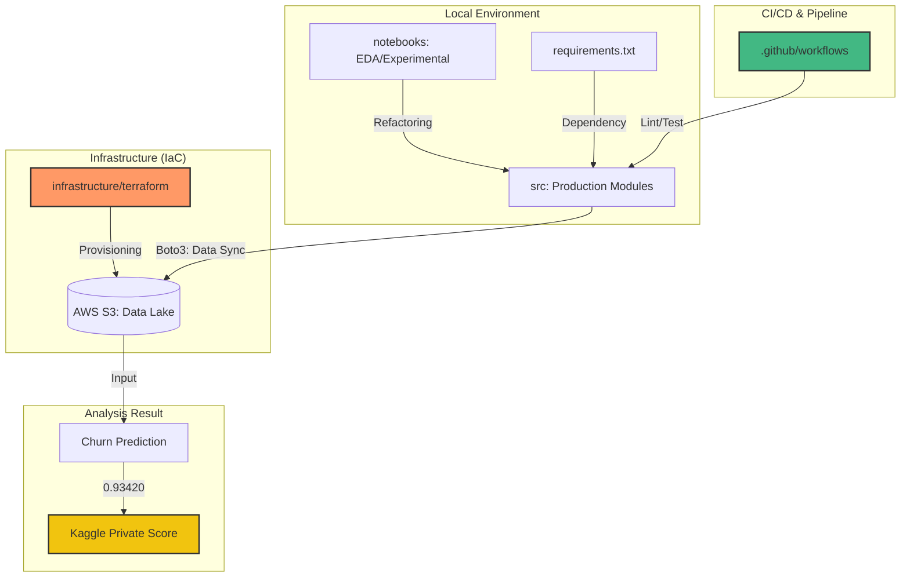

-----

# 🚀 Bank Churn Prediction (Kaggle Private Score: 0.93420)


Kaggle Playground Series (Season 4, Episode 1) の銀行顧客離脱予測コンペティションにおいて、**Private Score 0.93420** を達成した解法リポジトリです。
本プロジェクトでは、高精度な予測モデルの構築に加え、**TerraformによるIaC（Infrastructure as Code）を用いたAWSデータレイクの自動構築**を統合し、実務レベルのMLOpsパイプラインを実装しています。

-----

## 📊 システムアーキテクチャ (System Architecture)

本プロジェクトの全体像です。実験（Notebook）から運用（src）、インフラ（Terraform）までを一貫して管理しています。



-----

## 📊 成果 (Results)

  - **Private Score**: 0.93420
  - **Public Score**: 0.93278
  - **Model**: LightGBM
  - **Infrastructure**: AWS S3 managed by Terraform

-----

## 🛠️ エンジニアリング・ハイライト & "Why" 思思考

### 1\. IaC によるデータ基盤の自動構築

  - **Action**: `infrastructure/terraform` にてAWS S3バケットをコード化。
  - **Why**: 手動構築による設定ミス（人為的ミス）を排除し、誰が実行しても同じ分析基盤が即座に完成する「再現性」と「冪等性」を担保するためです。

#### **証跡：Terraformによるリソース作成成功**

### 2\. クラウド・データパイプラインの実装

  - **Action**: Python (`boto3`) を用いた自動搬送パイプラインの実装。
  - **Why**: 実験データと本番データを分離し、将来的なワークフローエンジン（Airflow等）への組み込みやAPI化を見据えた「保守性の高い設計」を採用しました。

#### **証跡：データアップロードの完遂**

### 3\. GitHub Actions による品質担保

  - **Action**: `.github/workflows/ci.yml` による自動Lintチェックの実装。
  - **Why**: チーム開発において、致命的なシンタックスエラーやコード規約違反をマージ前に自動検知し、デプロイ後の障害リスクを最小化するためです。

-----

## 💡 分析のこだわり (Key Insights)

### 1\. ドメイン知識に基づく特徴量設計

  - **Insight**: 顧客ロイヤリティを可視化する **`Age_per_Product`** (Age / NumOfProducts) を考案。
  - **Why**: 「若年層で多くの商品を持つ顧客は離脱しにくい」というビジネス的仮説を数値化。単なる統計相関だけでなく、ビジネス的な説明力を重視しました。

### 2\. 一般化性能の追求

  - **Insight**: **5-fold Stratified K-Fold (OOF)** を採用。
  - **Why**: 実務では「過去のデータに過学習したモデル」は役に立ちません。PublicよりPrivateのスコアが高い（0.93278 → 0.93420）結果は、未知のデータに対する高い堅牢性の証明です。

-----

## 📂 プロジェクト構造 (Directory Structure)

```text
.
├── .github/workflows/ # GitHub Actions (CIパイプライン)
├── infrastructure/    # Terraform (AWS IaC定義)
├── src/               # 運用モジュール (Production modules)
├── notebooks/         # 実験用 (EDA/Experimentation)
├── docs/              # 証跡画像・ドキュメント
└── requirements.txt   # 依存ライブラリ
```

-----

## 🛠️ 使い方 (How to use)

### 1\. セットアップ

```bash
pip install -r requirements.txt

# インフラ構築
cd infrastructure/terraform
terraform init
terraform apply -auto-approve

# プロジェクトルートへ戻り、データアップロードを実行
cd ../../
python -m src.upload_data
```

-----

## 🎖️ About Me

**Kou Sato (Moheji)**
データエンジニア / データサイエンティスト
「技術をビジネスの価値に変換する」をモットーに、IaCからMLモデル構築まで一貫したデリバリーを追求しています。

-----